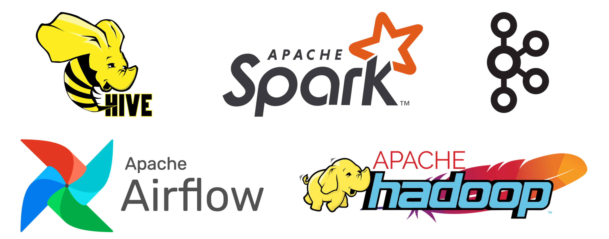

# Hadoop based Distributed System Docker Cluster



## Installed Components
1. **Airflow 2.7.0**
    - [apache/airflow:2.7.0-python3.8](https://hub.docker.com/layers/apache/airflow/2.7.0-python3.8/images/sha256-2a18a514e340fafd3652161cf54426b098c1e86c31162d8824bd16b3c7fff867?context=explore)
2. **Hadoop 2.8.0**
    - [big-data-europe/docker-hadoop-spark-workbench](https://github.com/big-data-europe/docker-hadoop-spark-workbench)
3. **Hive 2.3.2 (scala 2.11.8, python 2.7.9)**
    - [big-data-europe/docker-hive](https://github.com/big-data-europe/docker-hive/tree/2.3.2-postgresql-metastore)
4. **Spark 2.1.2**
    - [big-data-europe/docker-hadoop-spark-workbench](https://github.com/big-data-europe/docker-hadoop-spark-workbench)
5. **Kafka 7.0.0-css**
    - [confluentinc/cp-kafka:7.0.0](https://hub.docker.com/layers/confluentinc/cp-kafka/7.0.0/images/sha256-9b3f922f03bed5bab9cd62df8eaad7fd72d26a8b42d87bfcbde3905a4295ec25?context=explore)


## 1. Usage
1. Start an cluster \
    [run_cluster.sh](https://github.com/alchemine/hadoop-docker-cluster/blob/main/run_cluster.sh)
    ```
    run_cluster.sh
    ```

2. Stop an cluster \
    [stop_cluster.sh](https://github.com/alchemine/hadoop-docker-cluster/blob/main/stop_cluster.sh)
    ```
    stop_cluster.sh
    ```


## 2. Interfaces (port forwarding)
1. [Airflow](https://github.com/alchemine/hadoop-docker-cluster/blob/main/docker-compose-airflow.yml)
    - Webserver: http://localhost:8080
    - Worker: ssh://localhost:10022
2. [Hadoop](https://github.com/alchemine/hadoop-docker-cluster/blob/main/docker-compose-hadoop.yml)
    - Namenode: http://localhost:50070
    - Datanode: http://localhost:50075
    - Hue: http://localhost:8088
3. [Hive](https://github.com/alchemine/hadoop-docker-cluster/blob/main/docker-compose-hadoop.yml)
    - Server port: 10000
    - Metastore(postgreSQL) port: 9083
4. [Spark](https://github.com/alchemine/hadoop-docker-cluster/blob/main/docker-compose-hadoop.yml)
    - Master port: 7077
    - Master webui: http://localhost:18080
    - Worker port: **port forwarding X**
    - Worker webui: http://localhost:8081
    - Worker notebook: http://localhost:9001
5. [Kafka](https://github.com/alchemine/hadoop-docker-cluster/blob/main/docker-compose-kafka.yml)
    - Kafka port: 9092
    - Kafdrop: http://localhost:9000
    - `LISTENER_DOCKER_INTERNAL` port: 19092
    - `LISTENER_DOCKER_EXTERNAL` port: 9092


## 3. Airflow connections (example)
1. Hive
    1. hive_cli_conn
        - `Connection Id`: hive_cli_conn
        - `Connection Type`: Hive Client Wrapper 
        - `Host`: localhost (host IP)
        - `Port`: 10000
        - `Extra`: {"use_beeline": true}
2. Spark
    1. spark_conn
        - `Connection Id`: spark_conn
        - `Connection Type`: Spark
        - `Host`: local[*]
3. Kafka
    1. kafka_default
        - `Connection Id`: kafka_default
        - `Connection Type`: Apache Kafka
        - `Config Dict`
          ```
          {
            "bootstrap.servers": "kafka-server:19092",
            "group.id": "group_1",
            "security.protocol": "PLAINTEXT",
            "auto.offset.reset": "beginning"
          }
          ```
    2. kafka_listener
        - `Connection Id`: kafka_listener
        - `Connection Type`: Apache Kafka
        - `Config Dict`
          ```
          {
            "bootstrap.servers": "kafka-server:19092",
            "group.id": "group_2",
            "security.protocol": "PLAINTEXT",
            "auto.offset.reset": "beginning"
          }
          ```


## 4. Notice
- [Troubleshooting for Hue](https://github.com/big-data-europe/docker-hadoop-spark-workbench#important)


---

## References
- Maintainer of base repository([big-data-europe/docker-hadoop-spark-workbench](https://github.com/big-data-europe/docker-hadoop-spark-workbench)): Ivan Ermilov @earthquakesan
- https://github.com/ayyoubmaul/hadoop-docker
- https://medium.com/@ayyoubmaulana/developing-multi-nodes-hadoop-spark-cluster-and-airflow-in-docker-compose-part-1-10331e1e71b3
- https://github.com/mjstealey/hadoop
- https://jybaek.tistory.com/922
- https://1mini2.tistory.com/102
- https://airflow.apache.org/docs/apache-airflow/2.7.0/docker-compose.yaml
